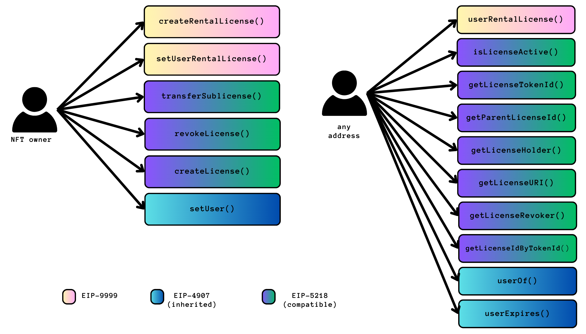

<br>

## Abstract

This standard is an extension of **ERC-721** and **ERC-4907**. It proposes an API for rights management through a rental license. This framework is fully compatible with the licensing framework proposed on **ERC-5218**, although it can be implemented independently.

As **ERC-4907** adds a user role to be granted to addresses with an expiration date (when the rental is over), **EIP-9999** extends the framework to allow the creation of a rental license that can be temporarily bound to the NFT `tokenId` until its `expires` UNIX timestamp ends. The rental license is defined through a URI for the license terms and an optional `parentLicenseId`, as per **ERC-5218**.


<br>

## Motivation


NFTs can have several utilities, from game utilities to creative work or real-world assets.
Permission management becomes essential as NFT owners might be interested in temporarily renting a token, permitting a "user" specific "using" rights while disallowing others, or simply allowing temporary access to the NFT. In addition, echoing the "real world," different roles might carry different rights conveyed by licensing documents. Thus, a legal mechanism to map the on-chain asset to the off-chain privileges is desirable.

**ERC-4907** introduced a framework for an additional role (rental user) that can be granted to their `address` with an expiration timestamp. For instance, the user role represents permission to "use" the NFT but not the ability to transfer it or set users. By introducing an `expires` attribute, the `owner` no longer needs to submit two on-chain transactions (one to list a new address as the new user role at the start of the rental and one to reclaim the user role at the end), but rather, can rely on the automatic end of a usage term without the need for a second transaction.

In parallel, **ERC-5218** introduced an API standard for managing NFT rights through a new primitive, `licenseId,` which maps a `tokenId` to a URI with a `JSON` standard containing a reference to a license (consisting of human-readable legal code and/or machine-readable summaries). We leverage the same standards for the simpler rental use case. Although our standard does not require the specification of sublicenses or revocation, the **ERC-5218** API could still be leveraged to create our temporary rental licenses.

By expanding **ERC-4907**'s API to support rental rights management and by supporting the framework introduced by **ERC-5218**, we introduce a simplified and rental-specific bridge for these standards.


<br>

## Specification


The keywords “MUST”, “MUST NOT”, “REQUIRED”, “SHALL”, “SHALL NOT”, “SHOULD”, “SHOULD NOT”, “RECOMMENDED”, “MAY”, and “OPTIONAL” in this document are to be interpreted as described in RFC 2119.

Every **ERC-9999** compliant contract MUST implement the `IERC9999` interface:


```solidity
pragma solidity ^0.8.0;

/// @title ERC-9999: Rental NFTs with Rights Management
interface IERC9999 {

  /// @dev Emits when a rental license is set to a rental NFT.
  /// The zero address for the user indicates that there is no user address.
  event UpdateRentalLicense(uint256 tokenId, uint256 licenseId, address user, uint64 expires);

  /// @dev Emits when a new rental license is created. 
  /// The zero value for `parentLicenseId` indicates there is no parent license.
  event CreateRentalLicense(uint256 licenseId, uint256 tokenId, uint256 parentLicenseId, string uri);

  /// @notice Get a user's rental license.
  /// @dev The zero value indicates no license.
  /// Throws if `tokenId` is not a valid NFT.
  /// @param tokenId The NFT to get the rental license for.
  /// @return licenseId The identifier of the rental license.
  function userRentalLicense(uint256 tokenId) external view returns(uint256);

  /// @notice Set the temporary user, expires, and rental license of an NFT.
  /// @dev The zero address indicates that the rental NFT has no user. 
  /// Throws if `tokenId` is not valid NFT.
  /// Throws if `licenseId` is not a valid license.
  /// Throws if `msg.sender` is not the owner of the NFT.
  /// Throws if `expires` is in the past.
  /// @param tokenId The NFT to be rented.
  /// @param user The new user of the NFT.
  /// @param licenseId The identifier of the rental license.
  /// @param expires UNIX timestamp the new user can use the NFT before it expires.
  function setUserRentalLicense(uint256 tokenId, address user, uint256 licenseId, uint64 expires) external;

  /// @notice Create a new rental license.
  /// @dev The zero value for parentLicenseId indicates the license has no parent.
  /// Throws if `tokenId` is not valid NFT.
  /// Throws if `msg.sender` is not the owner of the NFT.
  /// Throws uri is invalid.
  /// @param tokenId The NFT the rental license is issued upon.
  /// @param parentLicenseId The identifier for the parent license.
  /// @param uri The URI of the license terms.
  /// @return licenseId The identifier of the created rental license.
  function createRentalLicense(uint256 tokenId, uint256 parentLicenseId, string memory uri) external returns (uint256);
}
```

<br>


The event `UpdateRentalLicense` MUST be emitted when a user `address` is changed, or the user `expires` is changed, or a `licenseId` is changed.

The `CreateRentalLicense` event MUST be emitted when a new rental license is created.

The rental license MUST be compatible with `ERC-721`.

The license URI MAY point to a `JSON` file that conforms to the **ERC-5218 Metadata JSON Schema** as below, which adopts the "three-layer" design of the Creative Commons Licenses:

```json
{
    "title": "Rental License Metadata",
    "type": "object",
    "properties": {
        "legal-code": {
            "type": "string",
            "description": "The legal code of the rental license."
        },
        "human-readable": {
            "type": "string",
            "description": "The human readable rental license deed."
        },
        "machine-readable": {
            "type": "string",
            "description": "The machine readable code of the rental  license that can be recognized by software."
        }
    }
}
```

<br>


The rental license metadata SHOULD be stored on a decentralized storage service such as IPFS, adopting an IPFS-style URI that encodes the hash of the metadata for integrity verification.

The full API available with this standard, **ERC-4907**, and **ERC-5218** is shown in the diagram below (excluding **ERC-721**):

<br>


<p align="center">



<br>
<br>

## Backward Compatibility

This standard is compatible with the current **ERC-721**, **ERC-4907**, and **ERC-5218**  standards. A contract can inherit from **ERC-9999**, **ERC-721**, **ERC-4907**, and **ERC-5218** at the same time.


In addition, functions introduced in **EIP-9999** have many similarities with the existing functions from these standards, allowing developers to adopt the standard easily.


<br>

## Reference Implementation

A simple implementation of this standard, illustrating the data structures for `UserRentalInfo` (expanded from **ERC-4907**) and `RentalLicense` (compatible with **EIP-5218**) is shown below:

```solidity
// SPDX-License-Identifier: CC0-1.0
pragma solidity ^0.8.16;

import "forge-std/Test.sol";
import "./IERC9999.sol";
import "@openzeppelin/contracts/ownership/Ownable.sol";

contract ERC9999 is IERC9999, Ownable {

    struct UserRentalInfo {
        address user;   
        uint64 expires; 
        uint256 licenseId;
    }

    struct RentalLicense {
        uint256 tokenId;        
        uint256 parentLicenseId;
        string uri;              
    }
  
    mapping (uint256 => UserRentalInfo) private _users;     // maps from an NFT to its user, expiration, and rental license identifier
    mapping (uint256 => RentalLicense) private _licenses;   // maps from a rental license identifier to a rental license struct object
    mapping (uint256 => uint256) private _licenseIds;       // maps from an NFT to its rental license identifier

    /// @notice Get the rental license of an NFT.
    /// @dev The zero value indicates that there is no license.
    /// Throws if `tokenId` is not a valid NFT.
    /// @param tokenId The NFT to get the rental license for.
    /// @return licenseId The identifier of the rental license.
    function userRentalLicense(uint256 tokenId) external view returns(uint256) {

        require(tokenId != 0, "ERC9999: tokenId is not valid");

        return _users[tokenId].licenseId;
    }

    /// @notice Set the temporary user, expires, and rental license of an NFT.
    /// @dev The zero address indicates that the rental NFT has no user. 
    /// Throws if `tokenId` is not valid NFT.
    /// Throws if `licenseId` is not a valid license.
    /// Throws if `msg.sender` is not the owner of the NFT.
    /// Throws if `expires` is in the past.
    /// @param tokenId The NFT to be rented.
    /// @param user The new user of the NFT.
    /// @param licenseId The identifier of the rental license.
    /// @param expires UNIX timestamp the new user can use the NFT before it expires.
    function setUserRentalLicense(uint256 tokenId, address user, uint256 licenseId, uint64 expires) external onlyOwner {

            require(tokenId != 0, "ERC9999: tokenId is not valid");
            require(licenseId != 0, "ERC9999: licenseId is not valid");
            require(expires > block.timestamp, "ERC9999: expires is not valid");

            _users[tokenId] = UserRentalInfo(user, expires, licenseId);     

            emit UpdateRentalLicense(tokenId, licenseId, user, expires);
    }

    /// @notice Create a new rental license.
    /// @dev The zero value for parentLicenseId indicates the license has no parent.
    /// Throws if `tokenId` is not valid NFT.
    /// Throws if `msg.sender` is not the owner of the NFT.
    /// Throws uri is invalid.
    /// @param tokenId The NFT the rental license is issued upon.
    /// @param parentLicenseId The identifier for the parent license.
    /// @param uri The URI of the license terms.
    /// @return licenseId The identifier of the created rental license.
    function createRentalLicense(uint256 tokenId, uint256 parentLicenseId, string memory uri) external onlyOwner returns (uint256) { 

        require(tokenId != 0, "ERC9999: tokenId is not valid");
        require(bytes(uri).length != 0, "ERC9999: uri is not valid");

        uint256 licenseId = _getNextLicenseId();
        _licenses[licenseId] = RentalLicense(tokenId, parentLicenseId, uri);
        _licenseIds[tokenId] = licenseId;

        emit CreateRentalLicense(licenseId, tokenId, parentLicenseId, uri);

        return licenseId;
    }

    /// @notice Get the next rental license identifier.
    /// @dev Throws if the identifier overflows.
    /// @return licenseId The next rental license identifier.
    function _getNextLicenseId() private view returns (uint256) {

        uint256 _licenseIdTracker = 1;
        while (true) {
            if (_licenseIds[_licenseIdTracker] == 0) {
                break;
            }
            _licenseIdTracker++;

        }

        require(_licenseIdTracker < 2**256 - 1, "ERC9999: licenseId overflow");

        return _licenseIdTracker;
    }
} 
```

<br>


## Test Cases


Test cases are available [here](eip-9999-test/):

```solidity
pragma solidity ^0.8.13;

import {Test} from "forge-std/Test.sol";
import {ERC9999} from "../src/erc9999.sol";

contract ERC9999Test is Test {

    ERC9999 e;
    address user = address(0xbeef);
    string tokenURI = "someTokenURI";
    string licenseURI = "someLicenseURI";
    uint256 tokenId = 1;
    uint256 parentLicenseId = 0;
    uint64 expires = 1737586800;

    event CreateRentalLicense(uint256 licenseId, uint256 tokenId, uint256 parentLicenseId, string uri);
    event UpdateRentalLicense(uint256 tokenId, uint256 licenseId, address user, uint64 expires);

    function setUp() public {
        vm.deal(user, 10 ether);
        e = new ERC9999();
    }

    function testERC9999() public {
        
        // Test license creation (createRentalLicense)
        vm.expectEmit(); 
        emit CreateRentalLicense(1, tokenId, parentLicenseId, licenseURI);
        uint256 licenseId = e.createRentalLicense(tokenId, parentLicenseId, licenseURI);
        assertEq(e.getLicenseURI(licenseId), licenseURI, "License URI should match");
        
        // Test setting userRentalLicense
        vm.expectEmit();
        emit UpdateRentalLicense(tokenId, licenseId, user, expires);
        e.setUserRentalLicense(tokenId, user, licenseId, expires);        

        // Test license lookup (userRentalLicense)
        assertEq(e.userRentalLicense(tokenId), licenseId, "LicenseId should match");

    }
}
```


<br>

## Security Considerations
This EIP standard can inherently protect the owner's rights as they can change the NFT user and `expires` at any time.

Implementation of the **IERC9999** standard MUST consider following the security considerations from **IERC5218** if they are to implement their full license standard.


<br>

## Copyright

Copyright and related rights waived via [CC0](LICENSE.md).
